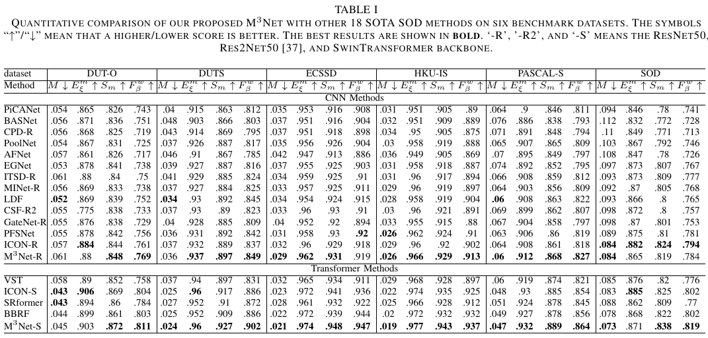

# M<sup>3</sup>Net: Multilevel, Mixed and Multistage Attention Network for Salient Object Detection
source code for our M<sup>3</sup>Net. 


## Environment

Python 3.9.13 and Pytorch 1.11.0. Details can be found in `requirements.txt`

## Data Preparation
All datasets used can be downloaded at [here](https://pan.baidu.com/s/1fw4uB6W8psX7roBOgbbXyA) [arrr].

### Training set
We use the training set of [DUTS](http://saliencydetection.net/duts/) to train our M<sup>3</sup>Net. 

### Testing Set
We use the testing set of [DUTS](http://saliencydetection.net/duts/), [ECSSD](http://www.cse.cuhk.edu.hk/leojia/projects/hsaliency/dataset.html), [HKU-IS](https://i.cs.hku.hk/~gbli/deep_saliency.html), [PASCAL-S](http://cbi.gatech.edu/salobj/), [DUT-O](http://saliencydetection.net/dut-omron/), and [SOD](http://elderlab.yorku.ca/SOD.) to test our M<sup>3</sup>Net. After Downloading, put them into `/datasets` folder.

Your `/datasets` folder should look like this:

````
-- datasets
   |-- DUT-O
   |   |--imgs
   |   |--gt
   |-- DUTS-TR
   |   |--imgs
   |   |--gt
   |-- ECSSD
   |   |--imgs
   |   |--gt
   ...
````

## Training and Testing
1. Download the pretrained backbone weights and put it into `pretrained_model/` folder. [ResNet](https://pan.baidu.com/s/1JBEa06CT4hYh8hR7uuJ_3A) [uxcz], [SwinTransformer](https://github.com/microsoft/Swin-Transformer), [T2T-ViT](https://github.com/yitu-opensource/T2T-ViT), [EfficientNet](https://github.com/lukemelas/EfficientNet-PyTorch) are currently supported. 

2. Run `python train_test.py --train True --test True --record='record.txt'` for training and testing. The predictions will be in `preds/` folder and the training records will be in `record.txt` file.
We will provided our trained models soon. 

## Evaluation
Pre-calculated saliency maps: [M3Net-R](https://pan.baidu.com/s/1q4Sp_M-Ph58OsCX1f_c0Ow) [uqsr], [M3Net-S](https://pan.baidu.com/s/1m1jF69FaavK4vbPp3B6AcQ) [6jyh]\
Pre-trained weights of the M<sup>3</sup>Net will be released soon. 

For *PR curve* and *F curve*, we use the code provided by this repo: [[BASNet, CVPR-2019]](https://github.com/xuebinqin/Binary-Segmentation-Evaluation-Tool)\
For *MAE*, *F measure*, *E score* and *S score*, we use the code provided by this repo: [[PySODMetrics]](https://github.com/lartpang/PySODMetrics)

## Evaluation Results
### Quantitative Evaluation

### Visual Comparison


## Acknowledgement
Our code is inspired by [VST](https://github.com/nnizhang/VST) and [MiNet](https://github.com/lartpang/MINet). Thanks for their excellent works.
We also thank [lartpang](https://github.com/lartpang/PySODMetrics) for providing the efficient evaluation tool. 

<!--
## Citation
If you think our work is helpful, please cite 
```

```
-->
